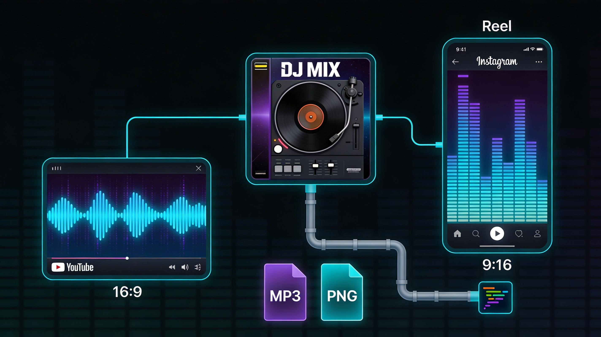

# Teaser Video Generator


[](https://opensource.org/licenses/MIT)
[](https://www.remotion.dev/)
[](https://react.dev/)

Automated creation of teaser videos for DJ mixes with random templates and variations.

## Features

- **5 Video Templates**: cinematic-premium, neon-wave, prism-glass, cinematic-poster, mono-pulse
- **Random Template Selection**: Each render can use a different template
- **Multiple Variants**: Generate 1-3 variations per mix
- **Visual Effects**: Light Leaks and Starburst (configurable)
- **Audio-reactive Equalizer**: Bars that react to the music
- **Configurable Start Offset**: Set start time in MM:SS format
- **Auto Audio Caching**: Reuse or regenerate audio clips
- **Multi-Format Output**: YouTube (1920×1080) and Instagram Reels (1080×1920)

## Quick Start

### Start Studio (Editor)
```bash
pnpm start
```
Then open: http://localhost:3000

### Render Video
```bash
pnpm teaser
```

## Project Structure

```
animate_vid/
├── config/
│   ├── teaser-config.json         # Active configuration
│   └── teaser-config.example.json # Full reference
├── public/
│   ├── DJ Hulk - Mix176_Tech House.mp3   # Source audio
│   ├── Mixcloud Post Mix176.png           # Cover image
│   └── teaser_audio_176.mp3              # Generated audio clip
├── scripts/
│   ├── build-teaser.js         # Build script
│   └── build-teaser.test.js    # Tests
├── src/
│   ├── Root.tsx               # Remotion root (5 templates)
│   ├── Effects.tsx           # Light Leaks & Starburst
│   ├── TeaserCinematicPremium.tsx
│   ├── TeaserNeonWave.tsx
│   ├── TeaserPrismGlass.tsx
│   ├── TeaserCinematicPoster.tsx
│   └── TeaserMonoPulse.tsx
├── out/
│   └── *.mp4                  # Output videos
└── package.json
```

## Configuration

Edit `config/teaser-config.json`:

```json
{
  "title": "DJ Hulk Sunday House Mix",
  "subtitle": "Checkout the full hour mix on Mixcloud",
  "template": "random",
  "startOffset": null,
  "variants": 1,
  "cacheAudioClip": false,
  "effects": {
    "lightLeaks": true,
    "starburst": true,
    "lightLeaksIntensity": 1.0,
    "starburstIntensity": 1.0
  },
  "formats": {
    "youtube": true,
    "instagram": true
  }
}
```

### Config Options Reference

| Parameter | Type | Description | Default |
|-----------|------|-------------|---------|
| `title` | string | Main video title | - |
| `subtitle` | string | Subtitle text | - |
| `template` | string | Template name | `"random"` |
| `startOffset` | string/null | Audio start time (MM:SS) | `null` |
| `variants` | number | Number of variants (1-3) | `1` |
| `cacheAudioClip` | boolean | Reuse audio clips | `false` |
| `effects.lightLeaks` | boolean/string | Enable Light Leaks | `"random"` |
| `effects.starburst` | boolean/string | Enable Starburst | `"random"` |
| `effects.lightLeaksIntensity` | number | Intensity 0-1 | `1.0` |
| `effects.starburstIntensity` | number | Intensity 0-1 | `1.0` |
| `formats.youtube` | boolean | YouTube format | `true` |
| `formats.instagram` | boolean | Instagram format | `true` |

### Template Options

| Value | Description |
|-------|-------------|
| `"random"` | Random template each render |
| `"cinematic-premium"` | Full cinematic with equalizer bars |
| `"neon-wave"` | Neon glow aesthetic with wave bars |
| `"prism-glass"` | Glassmorphism style with device mockups |
| `"cinematic-poster"` | Clean poster style with subtle equalizer |
| `"mono-pulse"` | Monochrome with large equalizer |

### Effects Options

| Value | Description |
|-------|-------------|
| `true` | Always enable |
| `false` | Always disable |
| `"random"` | Randomly enable (~60% Light Leaks, ~40% Starburst) |

### startOffset Options

| Value | Description |
|-------|-------------|
| `null` | Random offset between 30s and (audio length - 20s) |
| `"MM:SS"` | Specific start time (e.g. `"1:30"` = 90 seconds) |

## Usage

### Adding Source Files

1. Place MP3 file in `public/` (e.g., `DJ Hulk - Mix176_Tech House.mp3`)
2. Place PNG cover in `public/` (e.g., `Mixcloud Post Mix176.png`)

The script detects matching pairs by the number in the filename:
- `Mix176` ↔ `Mix176`
- `Mix-178` ↔ `Mix178`

### Generating Videos

```bash
pnpm teaser
```

Output:
- `out/DJ Hulk - Mix176_teaser.mp4` - YouTube format
- `out/DJ Hulk - Mix176_teaser_insta.mp4` - Instagram format

### Examples

```json
{
  "template": "cinematic-premium",
  "startOffset": "2:30",
  "variants": 3,
  "effects": {
    "lightLeaks": false,
    "starburst": true,
    "starburstIntensity": 0.8
  }
}
```

## Variations System

Each render gets random variations:

| Variation | Range |
|-----------|--------|
| Color Palette | 5 options (Cyber Cyan, Sunset Pulse, Acid Green, Neon Pink, Steel Blue) |
| Speed Multiplier | 0.8x - 1.2x |
| Text Effect | glow, slide, scale, pulse |
| Equalizer Style | bars, wave, mirrored, circle |
| Vignette | 0.6 - 0.9 |
| Background Zoom | 1.0 - 1.15 |

## Template Features

| Template | Layout | Visualizer | Text Effect | Special Effects |
|----------|--------|-----------|-------------|----------------|
| **MonoPulse** | Centered | Bars (even frequency) | Glow (pulsing) | Pulse rhythm |
| **CinematicPoster** | Bottom-left | Bars (drift) | Glow/Slide/Scale | Drift animation |
| **PrismGlass** | Centered + Cards | Mini-bars in frames | Glow/Slide/Scale | Glassmorphism |
| **NeonWave** | Centered | Mirrored waveform | Glow | HSL color shift |
| **CinematicPremium** | Side (vertical) | Bars | Glow/Slide/Scale (pulsing) | Vignette, styles |

## Technical Details

| Parameter | YouTube | Instagram |
|-----------|---------|-----------|
| Resolution | 1920×1080 | 1080×1920 |
| Aspect Ratio | 16:9 | 9:16 |
| Framerate | 30 fps | 30 fps |
| Duration | 20s | 20s |
| Codec | H.264 | H.264 |

## Development

### Run Tests

```bash
pnpm test
```

### Start Dev Server

```bash
pnpm start
```

## Tech Stack

- [Remotion](https://www.remotion.dev/) - Video in React
- React 18
- TypeScript
- Jest (testing)
- FFmpeg (audio processing)

## License

MIT